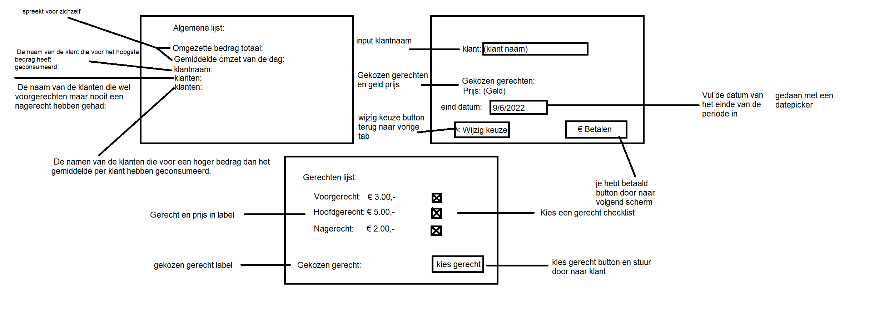

# Startdocument voor Catering

Startdocument van **Robin van Dijk**. Student number **5018927**.

## commentaar van probleem

Een bedrijf verzorgt de catering van personen. Voor de periode aangegeven 
met een begindatum en een einddatum wordt de administratie voor een aantal 
klanten verwerkt. Een klant kan op een dag een voorgerecht (3 euro) en of een 
hoofdgerecht (5 euro) en of een nagerecht (2 euro) gebruiken. 
Er dient een programma te worden ontwikkeld waarmee voor elke klant de 
naam, het aantal voorgerechten, aantal hoofdgerechten en aantal nagerechten 
wordt opgeslagen die de klant heeft gehad. Uiteindelijk wil het bedrijf de 

volgende informatie gepresenteerd hebben:
> Het totaal omgezette bedrag;
> De gemiddelde omzet per dag;
> De naam van de klant die voor het hoogste bedrag heeft 
geconsumeerd;
> De naam van de klanten die wel voorgerechten maar nooit een 
nagerecht hebben gehad;
> De namen van de klanten die voor een hoger bedrag dan het 
gemiddelde per klant hebben geconsumeerd.

### Input & Output

In deze sectie wordt omschreven wat de input en output zal zijn.

#### Input

In de tabel hieronder zal alle input (die de gebruiker moet neerzetten in volgorde om de applicatie te laten werken) worden omschreven.

|Casus|Type|Conditie|
|----|----|----------|
|bedrijf nummer|`integer`|`number` > 0|
|Klant nummer|`integer`|`number` > 0|
|Naam van klant|`String` |niet leeg|
|begin datum|`Date`|leeg|
|eind datum|`Date`|leeg|
|voorgerecht|`double`|`number` !> 1|
|hoofdgerecht|`double`|`number` !> 1|
|nagerecht|`double`|`number` !> 1|

#### Output

|Casus|Type|
|----|----|
|Het totaal omgezette bedrag|`double`|
|de gemiddelde omzet per dag|`double`|
|naam van klant die voor het hoogste bedrag heeft geconsumeerd|`string`|
|naam van klanten die wel een voorgerecht hebben gehad maar nooit een nagerecht|`string`|
|naam van klanten die voor een hoger bedrag dan het gemiddelde per klant hebben geconsumeerd|`string`|

#### Berekeningen

|Casus              |Berekening                        |
| ----------------- | ---------------------------------- |
|Prijs van een gerecht |een opsomming van alle gerecht prijsen |
|gemiddelde opbrengst in een dag|de gemiddelde opbrengst van die dag|
|klant die hoogste bedrag heeft geconsumeerd|hoogste bedrag tot nu|
|klant die een hoger bedrag dan gemiddelde heeft geconsumeerd per klant|hoger bedrag dan gemiddelde klant|

#### Opmerkingen

* Input zal worden gevalideerd.

## Lay-out van de GUI

## Klassen Diagram

## Testplan

In deze sectie zullen de tescasus worden omschreven om de applicatie te testen.

### Test Data

In de volgende tabellen vind je de benodigde data voor het testen.

#### Klant

| ID            | Input                             | Code                              |
| ------------- | --------------------------------- | --------------------------------- |
| `jannie` | name: jannie | `new Klant("jannie")` |
| `patrick` | name: patrick | `new Klant("patrick")` |

#### Gerecht

| ID            | Input                             | Code                              |
| ------------- | --------------------------------- | --------------------------------- |
| `voorgerecht` | gerecht: voorgerecht   prijs: 3.00 | `new Gerecht("voorgerecht", 3.00)` |
| `hoofdgerecht` | gerecht: hoofdgerecht   prijs: 5.00 | `new Gerecht("hoofdgerecht", 5.00)` |
| `nagerecht` | gerecht: nagerecht   prijs: 2.00 | `new Gerecht("nagerecht", 2.00)` |

### Test Cases

In deze sectie worden de testcasus omschreven. elke test casus zou moeten worden uitgevoerd met de test data als start punt.

#### #1 klant geconsumeerd

Ophalen wat de klant tot nu heeft geconsumeerd

|Step|Input|Action|Expected output|
|----|-----|------|---------------|
|1|  | `klantGeconsumeerd()` |10.00|

#### #2 Klantnaam hoogst geconsumeerd

Ophalen van de klantnaam die het hoogste bedrag heeft geconsumeerd

|Step|Input|Action|Expected output|
|----|-----|------|---------------|
|1| | `hoogsteBedragGeconsumeerd()`|`jannie`|

#### #3 gemiddelde omzet

Ophalen van de gemiddelde omzet van de dag

|Step|Input|Action|Expected output|
|----|-----|------|---------------|
|1| | `omzetVanDag()`|15.00|

#### #4 Klantnaam hoger dan gemiddelde geconsumeerd

Ophalen van klanten die een hoger bedrag dan de gemiddelde klant heeft geconsumeerd

|Step|Input|Action|Expected output|
|----|-----|------|---------------|
|1| | `klantGeconsumeerdMeerDanGemiddeld()` |`jannie`|

#### #5 totale omzet

Ophalen van de totale omzet die tot nu is gemaakt

|Step|Input|Action|Expected output|
|----|-----|------|---------------|
|1| | `gemiddeldeOmzet()` |15.00|

#### #6 Klantnaam nooit nagerecht

Ophalen van de klanten die wel een voorgerecht hebben gehad maar nooit een nagerecht

|Step|Input|Action|Expected output|
|----|-----|------|---------------|
|1| | `klantNooitNagerechtGehad()`|`patrick`|
